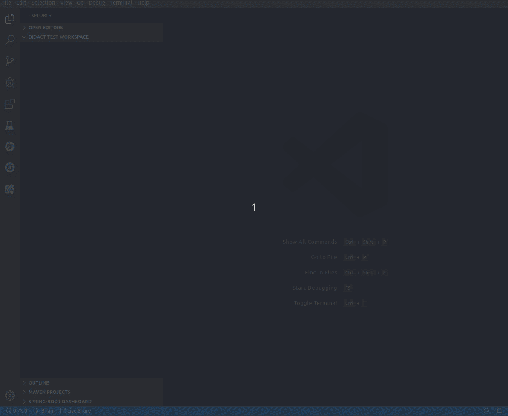

# vscode-didact README  

The **vscode-didact** extension prototype does a few things. Mainly it shows what's possible through a combination of a simple Markdown file, the VS Code Webview, and calling easily accessible commands in VS Code.

## VSCode-Didact In Action

What follows is a simple example with three actions. One scaffolds a project based on a structure defined in JSON. One opens a file created when the folder structure was created. And one triggers a command in a different extension if it's installed. The tutorial is defined in [this MarkDown file](./example/tutorial2.md)



# Implementation Notes

## Accessing Didact in the workspace. 

With Didact installed, there are two ways to open a Didact window.

* To access Didact, access the Command Palette (`View->Command Palette`, `Ctrl+Shift+P`, or `F1`) and type **Didact**. Select `Open Didact` and it will open with the default Didact Markdown file specified in the Settings.
* To open a local Didact file in the workspace directly, Right-click on the Didact Markdown file (`*.md`) and select **Start Didact Tutorial from File** from the context menu. (Note that it also works to render most standard Markdown files.)

You can also access Didact's scaffolding capabilities by right-clicking on a `*.json` file formatted in the way Didact knows and select **Didact Scaffold Project from File**. [See Project JSON Structure](#project-json-structure) below for details about how to construct the project json file.

## Didact Settings 

To change the default Didact file, access the settings (`File->Preferences->Settings`), type **Didact** and set the `Didact: Default Url`. This can be any valid URL to a Didact formatted Markdown file, including `http://`, `https://`, or `file://` URLs.


## CSS Styling

Currently we are using the CSS template suggested by the W3C, as provided [here at the Quackit.com site](https://www.quackit.com/css/css_template.cfm). We may be able to reuse some of the PatternFly approach, but that will require additional research.

## Didact Link formatting for opening Didact files inside VS Code

Didact now has the ability to open Didact files themselves, which enables us to leverage files that are at public URLs, such as those put into Github repositories as well as those provided in extension source files or even in scaffolded projects. This capability comes in handy if you want to mix and match tutorials and commands, breaking up lengthy processes into smaller chunks.

* You supply https or http links in the format `vscode://redhat.vscode-didact?https=urltofile/file.md` or `vscode://redhat.vscode-didact?http=urltofile/file.md`
* You supply `extension` links in the format `vscode://redhat.vscode-didact?extension=folder/file.md`
* You supply `workspace` links in the format `vscode://redhat.vscode-didact?workspace=folder/file.md`

Within a given Didact tutorial Markdown file, you can then mix and match link styles, opening other tutorials or launching commands with [Didact link formatting](https://github.com/bfitzpat/vscode-didact#link-formatting)

## Didact Link formatting for calling Commands

The Didact webview is listening for link events and responds if a link starts with `didact`. 

Examples:

* `didact://?commandId=vscode.didact.scaffoldProject&srcFilePath='example/project.json'`
* `didact://?commandId='vscode.openFolder'&projectFilePath='simpleGroovyProject/src/simple.groovy'&completion='Opened the simple.groovy file'`
* `didact//?commandId='camelk.startintegration'&projectFilePath='simpleGroovyProject/src/simple.groovy'`

All Didact links have the following qualities:

* Starts with `didact:`
* Then works in pairs
  * `commandId=your.vscode.command.id`
  * (optional) `projectFilePath=my/file/path` (assumes it's in the user's workspace, so has the workspace root prepended)
  * (optional) `srcFilePath=my/src/file/path` (assumes it's in the extension source, so prepends the extension `__dirname`)
  * (optional) `completion='my%20notification%20message'` (to provide a human readable message to the user upon task completion - note that spaces must be replaced with %20)
  * (optional) `error='my%20error%20message'` (to provide a human readable message to the user upon task error - note that spaces must be replaced with %20)
  * Note: projectFilePath and srcFilePath should be mutually exclusive, but that distinction is not made at present

## Project JSON Structure

The Project JSON file structure is simply a collection of named folders and files, as follows:

```{
    "folders": [
    {
       "name":"simpleGroovyProject",
       "folders": [
         {
             "name":"src",
             "files": [
                 {
                     "name":"simple.groovy",
                     "content":"from('timer:groovy?period=1s')\n\t.routeId('groovy')\n\t.setBody()\n\t.simple('Hello Camel K from ${routeId}')\n\t.to('log:info?showAll=false')\n"
                 }
             ]
           }
     ]
    }
 ]
}
```

# Next steps

1. Create a way to register a Didact tutorial.
2. Create a way to get a list of registered tutorials.
3. Find the best way to ensure that files (project.json, commands referencing files in a project scaffolded by a project.json) are accessible across extensions (i.e. if I register a tutorial in Camel K, the Didact extension should be ok with finding all the available commands and any files)
4. Provide a better CSS that perhaps mimicks what is being done in the Integreatly Walkthroughs project. 
5. Look into finding ways to chain commands together so that you can do things like create a project and open a file all in one go.
6. Look at the Eclipse Cheat sheet approach to see if we can glean anything - http://help.eclipse.org/kepler/index.jsp?topic=%2Forg.eclipse.platform.doc.isv%2Freference%2Fextension-points%2FcheatSheetContentFileSpec.html 
7. Also look at the Integr8ly Walkthroughs to see if we can glean anything - https://github.com/integr8ly/tutorial-web-app-walkthroughs/tree/master/walkthroughs
8. Figure out how to stash the generated HTML from the markdown locally in the user's global workspace so that we can persist the state of checkboxes as the user works through various steps - essentially enabling it between sessions
9. Figure out a way to limit the `Start Didact Tutorial from File` context menu to only work for Didact files.
10. Figure out a way to limit the `Didact Scaffold Project from File` context menu to only work for Didact Project Scaffolding files.
11. Figure out a way to reference files from the project json structure instead of providing file content directly so file content is copied and more manageable going forward.

**Enjoy!**
